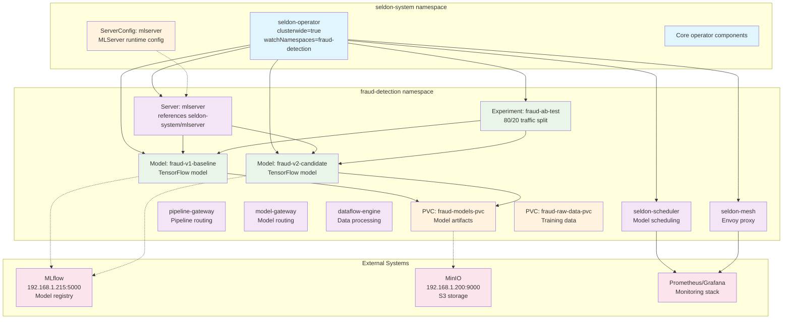
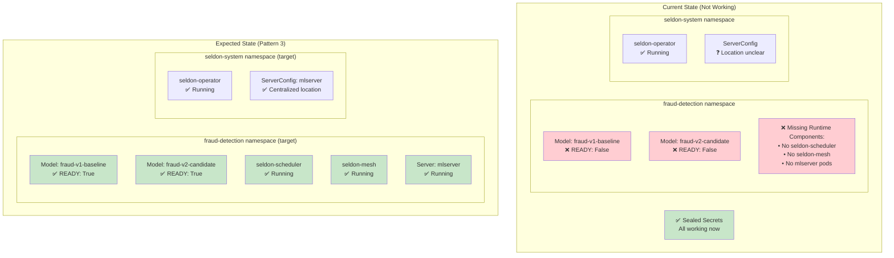

# Best Architecture Decision: Pattern 3 vs Pattern 4

## Overview

This document compares two Seldon Core v2 deployment patterns for our fraud detection project and provides a recommendation for moving forward.

## Pattern 3: Standard Scoped Operator (lc525 Recommended)

### Architecture



**Text Representation:**
```
seldon-system namespace:
├── seldon-operator (clusterwide=true, watchNamespaces=fraud-detection)
├── ServerConfig resources (centralized)
└── Core operator components

fraud-detection namespace:
├── seldon-scheduler
├── seldon-mesh (envoy)
├── pipeline-gateway
├── model-gateway
├── dataflow-engine
├── Server resources (reference ServerConfigs in seldon-system)
├── Model resources
└── Experiment resources
```

### Characteristics
- **Operator**: Lives in `seldon-system`, watches specific namespaces
- **Runtime**: Full runtime stack in each application namespace
- **ServerConfig**: Centralized in `seldon-system` namespace
- **Configuration**: `clusterwide=true` with `watchNamespaces` list

### Pros
- ✅ Officially supported by Seldon team
- ✅ Works with current Seldon Core v2.9.1 (no patches needed)
- ✅ Each namespace has its own scheduler (no single point of failure)
- ✅ Clear separation between operator and runtime

### Cons
- ❌ ServerConfigs must be managed centrally
- ❌ Application teams need platform team to modify ServerConfigs
- ❌ Less configuration isolation between teams

## Pattern 4: Enhanced Scoped Operator (Our Current Approach)

### Architecture
```
seldon-system namespace:
├── seldon-operator (clusterwide=false, watchNamespaces=[fraud-detection])
├── seldon-scheduler (shared)
├── Core operator components
└── Runtime components

fraud-detection namespace:
├── ServerConfig resources (namespace-scoped)
├── Server resources (reference local ServerConfigs)
├── Model resources
└── Experiment resources
```

### Characteristics
- **Operator**: Lives in `seldon-system`, watches specific namespaces
- **Runtime**: Shared runtime in `seldon-system`
- **ServerConfig**: Decentralized in application namespaces
- **Configuration**: `clusterwide=false` with `watchNamespaces` list

### Pros
- ✅ True configuration isolation (teams manage own ServerConfigs)
- ✅ Better multi-tenancy (complete namespace autonomy)
- ✅ Simplified runtime management (one runtime stack)
- ✅ Resource efficient (no duplicate schedulers)

### Cons
- ❌ Requires custom operator fix (not officially supported)
- ❌ Single scheduler is a potential bottleneck
- ❌ Diverges from Seldon's recommended patterns
- ❌ May break with future Seldon updates

## Key Differences

| Aspect | Pattern 3 | Pattern 4 |
|--------|-----------|-----------|
| **Operator Location** | seldon-system | seldon-system |
| **Runtime Location** | Each namespace | seldon-system only |
| **ServerConfig Location** | seldon-system | Application namespace |
| **Scheduler** | One per namespace | Shared single scheduler |
| **Official Support** | Yes | No (requires patch) |
| **Configuration Isolation** | Limited | Full |
| **Resource Usage** | Higher (duplicate runtimes) | Lower (shared runtime) |
| **Complexity** | Standard | Custom implementation |

## Current Status

We have invested significant effort in Pattern 4:
- ✅ Custom operator fix developed and tested
- ✅ Docker image built: `192.168.1.210/library/seldon-controller:fix-namespace-lookup-v4`
- ✅ Namespace structure created
- ✅ RBAC and network policies configured
- ⏳ Deployment pending

### Current Deployment Issue



## Recommendation: Switch to Pattern 3

Despite our investment in Pattern 4, I recommend **switching to Pattern 3** for the following reasons:

### 1. **Project Completion**
We need to demonstrate a working fraud detection A/B test. Pattern 3 will get us there faster without custom patches.

### 2. **Supportability**
Using Seldon's recommended pattern ensures:
- Official support from Seldon team
- Compatibility with future updates
- Alignment with documentation and examples

### 3. **Production Readiness**
Pattern 3 is battle-tested and used by other organizations. Our custom Pattern 4 introduces unnecessary risk.

### 4. **Minimal Functional Impact**
For our fraud detection demo:
- We only need one ServerConfig (mlserver)
- We're not showcasing multi-tenancy features
- Configuration isolation isn't a demo requirement

## Migration Path

To switch from Pattern 4 to Pattern 3:

1. **Update Helm values** for Seldon deployment:
   ```yaml
   controller:
     clusterwide: true
     watchNamespaces: "fraud-detection"
   ```

2. **Deploy runtime components** to fraud-detection namespace:
   ```bash
   helm install seldon-core-v2-runtime seldon-core-v2-runtime \
     --namespace fraud-detection
   ```

3. **Move ServerConfig** to seldon-system:
   ```bash
   kubectl apply -f serverconfig.yaml -n seldon-system
   ```

4. **Update Server references** (no changes needed - name stays the same)

5. **Apply manifests**:
   ```bash
   kubectl apply -k k8s/base/
   ```

## Conclusion

While Pattern 4 offers superior configuration isolation, it's not worth the complexity and risk for this project. Pattern 3 provides a clear path to completion with official support. We can revisit Pattern 4 enhancements after successfully demonstrating the core fraud detection capabilities.

**Action**: Proceed with Pattern 3 to achieve project completion, then consider Pattern 4 as a future enhancement if true multi-tenancy becomes a requirement.
